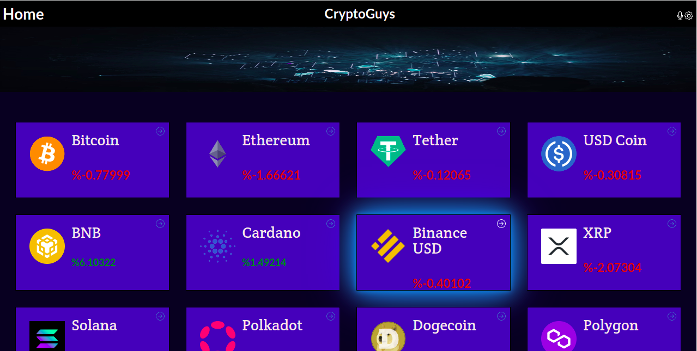
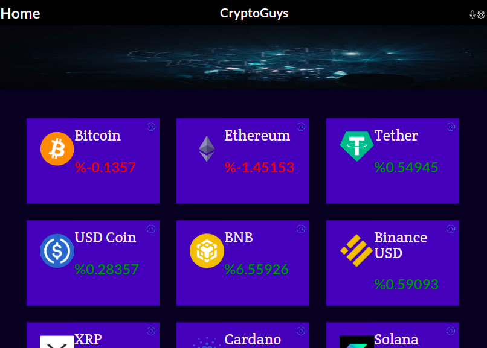
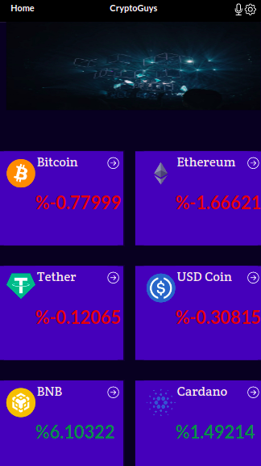

# CryptoGuys

> This is a Crypto currency chat app tha displays
   the latest changes in the crypto market over the last 24Hrs.

## Screenshots

- **Desktop View**




- **Tablet View**




- **Mobile View**




## Built With

- React js
- Redux
- JavaScript
- Semantic UI
- CoinGecko API
- Jest

## Live Demo

- https://62e51d2fab662b7f5fcc1786--unique-hummingbird-bef2b7.netlify.app/


## Getting Started

To get a local copy up and running follow these simple example steps.

### Prerequisites

- VS code/ Sublime text or any other editor
- Working internet connection

### Setup

-If you installed git you can clone the code to your machine, or download a ZIP of all the files directly.

-[Download the ZIP from this location](https://github.com/cyrilmuchemi/Metrics-Webapp), or run the following [git](https://git-scm.com/downloads) command to clone the files to your machine:

-```bash
git clone https://github.com/cyrilmuchemi/Metrics-Webapp. 

- Once the files are on your machine, open the _Crypto-Chart-App_ folder in [Visual Studio Code](https://code.visualstudio.com/), and follow the steps in Installation & Set Up


## 🛠 Installation & Set Up

1. Install Node Modules

   ```sh
   npm install

2. Start the development server

   ```sh
   npm start

3. Open [http://localhost:3000](http://localhost:3000) to view it in the browser.


## 🚀 Building and Running for Production

1. Generate a full static production build

    ```sh
   npm run build
   
   
## Authors

👤 **Author1**

- GitHub: [@cyrilmuchemi](https://github.com/cyrilmuchemi)
- Twitter: [@cyril muchemi](https://twitter.com/cyrilmuchemi)
- LinkedIn: [Cyril Muchemi](https://linkedin.com/in/cyrilmuchemi)


## 🤝 Contributing

Contributions, issues, and feature requests are welcome!

Feel free to check the [issues page](../../issues/).

## Show your support

Give a ⭐️ if you like this project!

## Acknowledgments

- CoinGecko API
- Nelson Sakwa on Behance

## 📝 License

This project is [MIT](./MIT.md) licensed.
